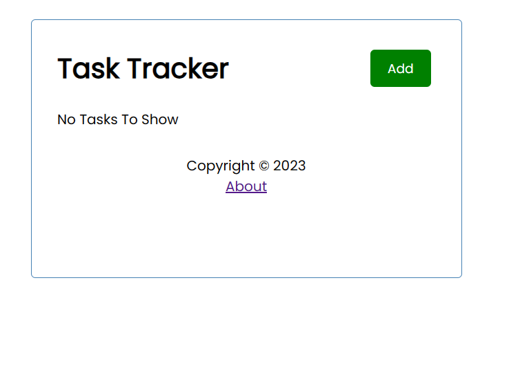
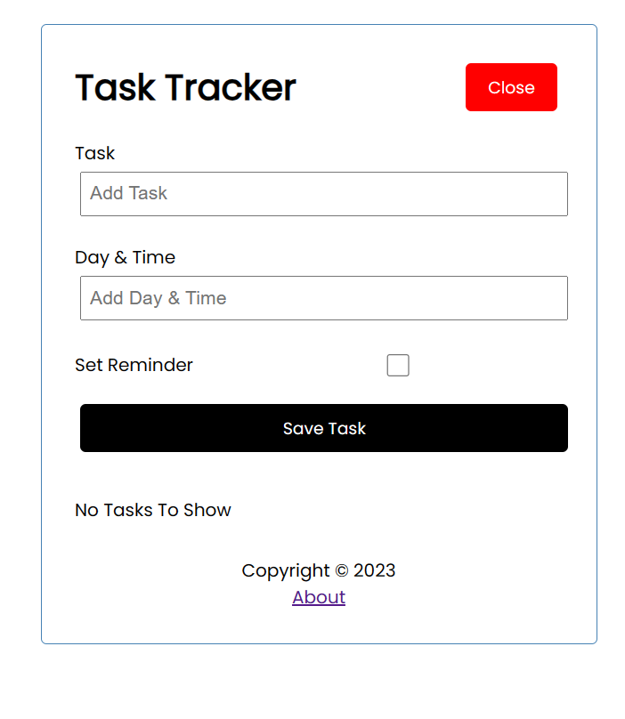
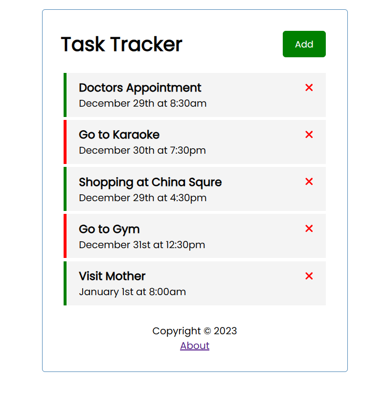
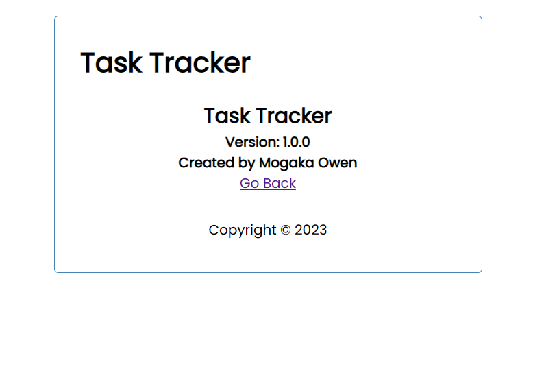

# Task Tracker App Using Angular

## In this project, a simple task tracker app was developed using angular for frontend and json server to simulate backend conditions

### This project was also done using React JS and can be found in the task-tracker-reactjs repository

##### The application looks as follows without a single task

---

##### To add a task, the following form is generated after clicking the add button to input a task

---

##### The application looks as follows with tasks added

The green means tasks with a reminder and the red ones are tasks without a reminder. When hovering over the tasks with reminders, it turns blue.

---

Clicking on the About link takes you to the about page with a go back functionality as shown

